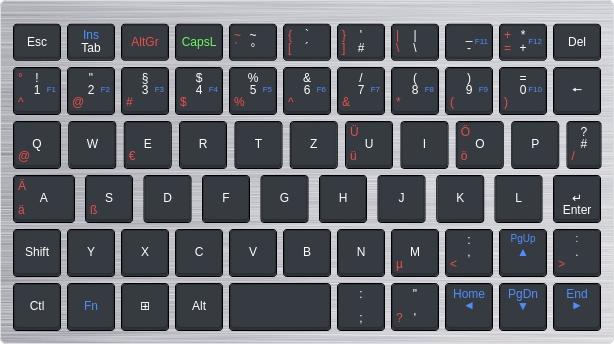

# "Denglisches" XKB-Tastaturlayout für GPD Pocket 2

## Vorbereiten der Firmware

Die englische Tastaturfirmware des GPD Pocket 2 macht aus der, mit japanischen Schriftzeichen bedruckten, Taste ein Duplikat der <kbd>TLDE</kbd>-Taste. Dabei könnte man diese Taste für nützlicheres verwenden: Dieses Tastaturlayout verwendet diese Taste als <kbd>AltGr</kbd>-Taste. Damit das funktioniert, muss die Japanische Tastatur-Firmware installiert werden. Am besten erledigt man dies, solange noch Windows auf dem GPD Pocket 2 installiert ist. Ist Linux schon installiert, lässt sich das Update problemlos mit einem [c't Notfall Windows](https://www.heise.de/ct/artikel/c-t-Notfall-Windows-2021-4954598.html) installieren.

Das Update kann direkt von der [GPD-Webseite](https://www.gpd.hk/gpdp2firmware) heruntergeladen werden. Es ist unter "Driver & BIOS" als "GPD Pocket 2 Keyboard Firmware (Japan)" zu finden.

Nachdem das Firmware-Update installiert ist, sind die <kbd>半/全</kbd> und die <kbd>TLDE</kbd>-Taste getrennte Tasten. ...und sie haben logisch die Plätze getauscht. Diesen Wechsel macht das Tastatur-Layout ebenfalls rückgängig.

**Achtung**: Dieses Layout habe ich auf meinem GPD Pocket 2 unter Arch Linux und Gnome mit Wayland getestet. Unter anderen Fenstermanagern und Display-Servern sollte es ebenfalls funktionieren. Allerdings können die Schritte zum Einrichten des Layouts von den hier beschriebenen abweichen.

## Was heißt 半/全?

Wer nicht etwas Klugscheißer-Wissen bunkern möchte, kann den nachfolgenden Absatz getrost überspringen.

Die <kbd>半/全</kbd>-Taste heißt ausgeschrieben wohl 半角/全角, was sich mit "halbe Breite/volle Breite" übersetzen lässt. Die [englische Wikipedia](https://en.wikipedia.org/wiki/Halfwidth_and_fullwidth_forms) hat hierzu folgende Informationen parat:

> Bei CJK (Chinesisch, Japanisch und Koreanisch) Software werden grafische Zeichen traditionell in Zeichen mit voller Breite (in Taiwan und Hong Kong: 全形; in CJK: 全角) und Zeichen mit halber Breite (in Taiwan und Hong Kong: 半形; in CJK: 半角) unterteilt. Bei Festbreitenschriftarten belegt ein Zeichen mit halber breite die Hälfte des horizontalen Platzes eines Zeichens mit voller Breite.

Diese Taste schaltet also auf der japanischen Tastatur zwischen den Zeichen mit halber und voller Breite um.

## Das Tastaturlayout

Dieses Tastaturlayout verbessert die Nutzung des GPD-Pocket für Nutzer, welche eine Tastatur im deutschen Standardlayout gewohnt sind. Einfach ein deutsches Layout zu laden führt dazu, dass viele der, ohnehin merkwürdig angeordneten, Tasten, komplett unsinnige Zeichen produzieren. Um halbwegs "blind" schreiben zu können und trotzdem hin und wieder ein seltenes Sonderzeichen über den Aufdruck der Tasten zu identifizieren, hat dieses Layout zwei Besonderheiten:

- Die Umlaute werden auf die Tasten ihrer zugehörigen Vokale gelegt. Sie können einfach über <kbd>Alt Gr</kbd> aktiviert werden. Auch das scharfe S, sowie das Mikro- und At-Zeichen lassen sich so schreiben.
- Die Belegung der Ziffernreihe lässt sich über <kbd>Alt Gr</kbd> auf die aufgedruckte Belegung umschalten.

Das hat zwar den Nachteil, dass die eckigen Klammern nicht mehr auf <kbd>8</kbd> und <kbd>9</kbd> passen, aber sie lassen sich über die Tasten oberhalb der <kbd>6</kbd> und <kbd>7</kbd> ebenso bequem eingeben.

<br>
[öffnen im Keyboard Layout Editor](http://www.keyboard-layout-editor.com/##@_background_name=Aluminium%20brushed&style=background-image%2F:%20url('%2F%2Fbg%2F%2Fmetal%2F%2Faluminum%2F_texture1642.jpg')%2F%3B%3B%3B&@_y:0.2&c=%232d3238&t=%23ffffff&p=CHICKLET&a:7&h:0.8%3B&=Esc&_t=%23073ff%0A%23ffffff&a:5&h:0.8%3B&=Ins%0ATab&_t=%23cc3030&a:7&h:0.8%3B&=AltGr&_t=%2330cc30&h:0.8%3B&=CapsL&_t=%23cc3030%0A%0A%0A%0A%0A%0A%0A%0A%23ffffff%0A%0A%23ffffff&a:4&h:0.8%3B&=~%0A%60%0A%0A%0A%0A%0A%0A%0A~%0A%0A%C2%B0&_h:0.8%3B&=%7B%0A%5B%0A%0A%0A%0A%0A%0A%0A%60%0A%0A%C2%B4&_h:0.8%3B&=%7D%0A%5D%0A%0A%0A%0A%0A%0A%0A'%0A%0A%23&_h:0.8%3B&=%7C%0A%5C%0A%0A%0A%0A%0A%0A%0A%7C%0A%0A%5C&_t=%23cc3030%0A%0A%0A%0A%0A%0A%0A%230073ff%0A%23ffffff%0A%0A%23ffffff&fa@:0&:0&:0&:0&:0&:0&:0&:1%3B&h:0.8%3B&=%0A%0A%0A%0A%0A%0A%0AF11%0A%2F_%0A%0A-&_h:0.8%3B&=+%0A%2F=%0A%0A%0A%0A%0A%0AF12%0A*%0A%0A+&_t=%23ffffff&a:7&h:0.8%3B&=Del%3B&@_y:-0.19999999999999996&t=%23cc3030%0A%0A%0A%0A%0A%0A%0A%230073ff%0A%23ffffff%0A%23ffffff&a:4%3B&=%C2%B0%0A%5E%0A%0A%0A%0A%0A%0AF1%0A!%0A1&=%0A%2F@%0A%0A%0A%0A%0A%0AF2%0A%22%0A2&=%0A%23%0A%0A%0A%0A%0A%0AF3%0A%C2%A7%0A3&=%0A$%0A%0A%0A%0A%0A%0AF4%0A$%0A4&=%0A%25%0A%0A%0A%0A%0A%0AF5%0A%25%0A5&=%0A%5E%0A%0A%0A%0A%0A%0AF6%0A%2F&%0A6&=%0A%2F&%0A%0A%0A%0A%0A%0AF7%0A%2F%2F%0A7&=%0A*%0A%0A%0A%0A%0A%0AF8%0A(%0A8&=%0A(%0A%0A%0A%0A%0A%0AF9%0A)%0A9&=%0A)%0A%0A%0A%0A%0A%0AF10%0A%2F=%0A0&_t=%23ffffff&a:7%3B&=%F0%9F%A0%94%3B&@_t=%23cc3030%0A%0A%0A%0A%0A%0A%0A%0A%0A%23ffffff&a:4%3B&=%0A%2F@%0A%0A%0A%0A%0A%0A%0A%0AQ&_x:0.02499999999999991&t=%23ffffff&a:7%3B&=W&_x:0.02499999999999991&t=%23cc3030%0A%0A%0A%0A%0A%0A%0A%0A%0A%23ffffff&a:4%3B&=%0A%E2%82%AC%0A%0A%0A%0A%0A%0A%0A%0AE&_x:0.02499999999999991&t=%23ffffff&a:7%3B&=R&_x:0.025000000000000355%3B&=T&_x:0.025000000000000355%3B&=Z&_x:0.025000000000000355&t=%23cc3030%0A%0A%0A%0A%0A%0A%0A%0A%0A%23ffffff&a:4%3B&=%C3%9C%0A%C3%BC%0A%0A%0A%0A%0A%0A%0A%0AU&_x:0.025000000000000355&t=%23ffffff&a:7%3B&=I&_x:0.025000000000000355&t=%23cc3030%0A%0A%0A%0A%0A%0A%0A%0A%0A%23ffffff&a:4%3B&=%C3%96%0A%C3%B6%0A%0A%0A%0A%0A%0A%0A%0AO&_x:0.025000000000000355&t=%23ffffff&a:7%3B&=P&_x:0.025000000000000355&t=%23cc3030%0A%0A%0A%0A%0A%0A%0A%0A%23ffffff%0A%23ffffff&a:4&w:0.75%3B&=%0A%2F%2F%0A%0A%0A%0A%0A%0A%0A%3F%0A%23%3B&@_t=%23cc3030%0A%0A%0A%0A%0A%0A%0A%0A%0A%23ffffff&w:1.25%3B&=%C3%84%0A%C3%A4%0A%0A%0A%0A%0A%0A%0A%0AA&_x:0.08299999999999996%3B&=%0A%C3%9F%0A%0A%0A%0A%0A%0A%0A%0AS&_x:0.08400000000000007&t=%23ffffff&a:7%3B&=D&_x:0.08300000000000018%3B&=F&_x:0.08300000000000018%3B&=G&_x:0.08399999999999963%3B&=H&_x:0.08300000000000018%3B&=J&_x:0.08999999999999986%3B&=K&_x:0.07699999999999996%3B&=L&_x:0.08300000000000018&a:5%3B&=%0AEnter%0A%0A%0A%0A%0A%E2%86%B5%3B&@_a:7%3B&=Shift&=Y&=X&=C&=V&=B&=N&_t=%23cc3030%0A%0A%0A%0A%0A%0A%0A%0A%0A%23ffffff&a:4%3B&=%0A%C2%B5%0A%0A%0A%0A%0A%0A%0A%0AM&_t=%23cc3030%0A%0A%0A%0A%0A%0A%0A%0A%23ffffff%0A%23ffffff%3B&=%0A%3C%0A%0A%0A%0A%0A%0A%0A%2F:%0A,&_t=%230073ff&a:5&fa@:2%3B%3B&=PgUp%0A%0A%0A%0A%0A%0A%E2%96%B2&_t=%23cc3030%0A%0A%0A%0A%0A%0A%0A%0A%23ffffff%0A%23ffffff&a:4&fa@:2&:0&:0&:0&:0&:0&:0&:0&:2%3B%3B&=%0A%3E%0A%0A%0A%0A%0A%0A%0A%2F:%0A.%3B&@_t=%23ffffff&a:7&f:3%3B&=Ctl&_t=%230073ff&f:3%3B&=Fn&_t=%23ffffff&f:3%3B&=%E2%8A%9E&_f:3%3B&=Alt&_w:2%3B&=&_a:5&f:3%3B&=%2F:%0A%2F%3B&_t=%23cc3030%0A%0A%0A%0A%0A%0A%0A%0A%23ffffff%0A%0A%23ffffff&a:4&f:3%3B&=%0A%3F%0A%0A%0A%0A%0A%0A%0A%22%0A%0A'&_t=%230073ff&a:5&f:3%3B&=Home%0A%0A%0A%0A%0A%0A%F0%9F%9E%80&_f:3%3B&=PgDn%0A%0A%0A%0A%0A%0A%E2%96%BC&_f:3%3B&=End%0A%0A%0A%0A%0A%0A%F0%9F%9E%82)

Nachfolgend alle Änderungen, dieses Tastaturlayouts im Überblick:

- <kbd>Z</kbd> und <kbd>Y</kbd> sind vertauscht.
- Die Taste <kbd>半/全</kbd> wird als <kbd>Alt Gr</kbd> verwendet. Daher nenne ich sie nachfolgend auch <kbd>Alt Gr</kbd>.
- Die Umlaute sind auf die Tasten <kbd>A</kbd>, <kbd>O</kbd> und <kbd>U</kbd> gelegt und lassen sich per <kbd>Atl Gr</kbd> erreichen.
- Auch das scharfe S ist über <kbd>Alt Gr</kbd>+<kbd>S</kbd> erreichbar.
- Die Sonderzeichen auf den Zifferntasten entsprechen der deutschen Belegung, sodass hier alles wie gewohnt per <kbd>Shift</kbd> erreichbar ist.
  - Die aufgedruckten Sonderzeichen lassen sich über die <kbd>Alt Gr</kbd>-Taste abrufen.
- Die Tasten für die Sonderzeichen in der ersten Reihe sind etwas anders belegt. Die Belegung der Tasten mit den eckigen Klammern muss man sich leider merken.
  - Mit <kbd>Alt Gr</kbd> bekommt man hier auch wieder die aufgedruckten Zeichen.
- Das Fragezeichen ist zusätzlich auf die Taste neben dem Steuerkreuz gewandert, sodass man es nicht nur per <kbd>Alt Gr</kbd>+<kbd>Shift</kbd>+<kbd>#</kbd> erreichen kann.

Auch wenn das Layout auf den ersten Blick etwas komisch anmutet, schreibt es sich nach kurzer Eingewöhnung besser als mit einem englischen oder deutschen Standardlayout.

## Installation des Layouts

Da Gnome ab Version 40 `libxkbregistry` verwendet, genügt es die Dateien aus `xkb` unter `~/.config/xkb` abzulegen um das neue, benutzerspezifische Layout verwenden zu können.

Nachdem man sich neu angemeldet hat, lässt sich das Tastaturlayout in den Gnome-Einstellungen auswählen. Es ist unter "Weitere" zu finden, indem man nach "GPD" sucht.

## Anpassen des Layouts

Das Mapping der Tasten wird über die Datei `custom` im Verzeichnis `symbols` definiert. Sie beginnt damit, dass deutsche Tastaturlayout zu importieren, da dieses die Basis für die Anpassungen darstellt. Anschließend wird festgelegt, dass alle Testen vier Ebenen haben können:

- keine Modifizierer
- <kbd>Shift</kbd>
- <kbd>Alt Gr</kbd>
- <kbd>Alt Gr</kbd>+<kbd>Shift</kbd>

Die Tasten werden in den Tastaturlayouts unter Verwendung der Tastencodes definiert. In der Regel bestehend die Tastencodes aus der Position der Taste auf der Tastatur. Die Zeilen werden als Buchstaben, die Spalten als Ziffern kodiert. `AB01` ist also die erste Taste in der zweiten Zeile der Tastatur.

Bei der Tastatur des GPD Pocket 2 ist das leider etwas komplizierter, da die Tasten wild durch die Gegend geschoben wurde. Die Zuordnung der Tastencodes für die japanischen Tastatur-Firmware sieht folgendermaßen aus:

<br>
[öffnen im Keyboard Layout Editor](http://www.keyboard-layout-editor.com/##@_background_name=Aluminium%20brushed&style=background-image%2F:%20url('%2F%2Fbg%2F%2Fmetal%2F%2Faluminum%2F_texture1642.jpg')%2F%3B%3B%3B&@_y:0.2&c=%232d3238&t=%23ffffff&p=CHICKLET&a:7&h:0.8%3B&=ESC&_t=%23228aba%0A%23ffffff&a:5&h:0.8%3B&=INS%0ATAB&_t=%23ffffff&a:7&h:0.8%3B&=TLDE&_t=%23228aba%0A%23ffffff&a:5&h:0.8%3B&=PRSC%0ACAPS&_t=%23ffffff&a:7&h:0.8%3B&=AE13&_h:0.8%3B&=AD11&_a:5&h:0.8%3B&=%0A%C2%B4%0A%0A%0A%0A%0AAD12&_a:7&h:0.8%3B&=AC12&_t=%23228aba%0A%23ffffff&a:5&h:0.8%3B&=FK11%0AAE11&_h:0.8%3B&=FK12%0AAE12&_t=%23ffffff&a:7&h:0.8%3B&=DELE%3B&@_y:-0.19999999999999996&t=%23228aba%0A%23ffffff&a:5%3B&=FK01%0AAE01&=FK02%0AAE02&=FK03%0AAE03&=FK04%0AAE04&=FK05%0AAE05&=FK06%0AAE06&=FK07%0AAE07&=FK08%0AAE08&=FK09%0AAE09&=FK10%0AAE10&_t=%23ffffff&a:7%3B&=BKSP%3B&@=AD01&_x:0.02499999999999991%3B&=AD02&_x:0.02499999999999991%3B&=AD03&_x:0.02499999999999991%3B&=AD04&_x:0.025000000000000355%3B&=AD05&_x:0.025000000000000355%3B&=AD06&_x:0.025000000000000355%3B&=AD07&_x:0.025000000000000355%3B&=AD08&_x:0.025000000000000355%3B&=AD09&_x:0.025000000000000355%3B&=AD10&_x:0.025000000000000355&w:0.75%3B&=AB10%3B&@_w:1.25%3B&=AC01&_x:0.08299999999999996%3B&=AC02&_x:0.08400000000000007%3B&=AC03&_x:0.08300000000000018%3B&=AC04&_x:0.08300000000000018%3B&=AC05&_x:0.08399999999999963%3B&=AC06&_x:0.08300000000000018%3B&=AC07&_x:0.08999999999999986%3B&=AC08&_x:0.07699999999999996%3B&=AC09&_x:0.08300000000000018%3B&=RTRN%3B&@=LFSH&=AB01&=AB02&=AB03&=AB04&=AB05&=AB06&=AB07&=AB08&_t=%23228aba%0A%23ffffff&a:5%3B&=PGUP%0AUP&_t=%23ffffff&a:7%3B&=AB09%3B&@=LCTL&=&=LWIN&=LALT&_w:2%3B&=SPCE&=AC10&=AC11&_t=%23228aba%0A%23ffffff&a:5%3B&=HOME%0ALEFT&=PGDN%0ADOWN&=END%0ARIGHT)

Um eine Taste neu zu belegen, wird ihre Definition überschrieben:

```text
key <AC01> { [ a, A, adiaeresis, Adiaeresis] };
```

Diese Zeile überschreibt die Zuordnung der Taste `AC01` mit den folgenden werten:

| Taste  | ohne Modifizierer | <kbd>Shift</kbd> | <kbd>Alt Gr</kbd> | <kbd>Alt Gr</kbd>+<kbd>Shift</kbd> |
|:------:|:-----------------:|:----------------:|:-----------------:|:----------------------:|
| `AC01` | `a` | `A` | `ä` | `Ä` |

Die Namen der Tasten (wie "adiaeresis" für "ä") kann man sich einfach in der Datei des deutsch Tastaturlayouts ausleihen (`/usr/share/X11/xkb/symbols/de`).

Anpassungen werden nach einem Neustart der Sitzung des Fenstermanagers aktiv.

**Achtung**: Änderungen am aktiven Tastaturlayout können den GPD Pocket 2 unbenutzbar machen. Es empfiehlt sich einen SSH-Server für den Fernzugriff einzurichten bevor man Änderungen am Layout vornimmt. Wenn man sich die Sitzung über `screen` oder `tmux` mit einem in Gnome geöffneten Terminal teilt, kann man in der Gnome-Sitzung über `gsettings set org.gnome.desktop.input-sources sources "[('xkb', 'en')]"` das Tastaturlayout wieder auf Englisch ändern.

## Y/Z tauschen

Das Tastaturlayout belegt natürlich die Tasten <kbd>Y</kbd> und <kbd>Z</kbd>, wie es für ein deutsches Tastaturlayout üblich ist. Damit ist jedoch die Beschriftung auf der Tastatur des GPD Pocket 2 nicht mehr korrekt. Mutige können die Kappen der beiden Tasten vertauschen (sie haben die gleiche Größe) und damit die Hardware der Software anpassen. Um die Tasten nicht zu beschädigen, muss man darauf achten, jede Taste von der, dem Bildschirm zugewandten Seite aus, nach oben zu hebeln. Die Tasten sind auf dieser Seite eingerastet und auf der anderen mit einer Nut geführt. Auf der falschen Seite zu hebeln, kann diese Führung abbrechen. Am besten zieht man die Taste nach oben und kippt sie dabei vom Bildschirm weg.

Zum Wiedereinsetzen kann man die Führung auf der dem Bildschirm abgewandten Seite einfädeln und die Taste dann fest herunterdrücken bis rechts und links einrastet.

**Achtung**: Das Tauschen der Tastenkappen kann diese beschädigen. Wer es versuchen möchte, handelt auf eigenes Risiko.
